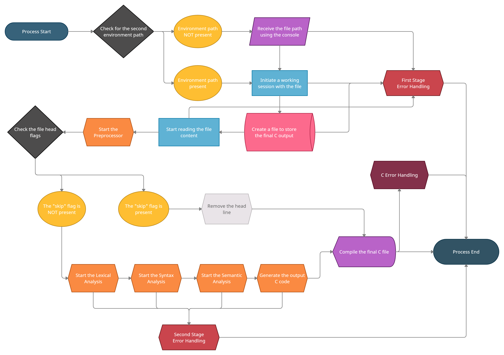

# EnderScript

EnderScript - *you may also refer to it by "ES" or "ECMSL-2021" (EnderCommunity Maintained Scripting Language 2021)* - is an experimental programming language. ***It's still not even functional, this is all just a pitch of the language itself.*** *ES* code compiles down to C code, which is then compiled to machine code.

The file extension of *ES* files is *`.esf`*. (Which stands for *`"EnderScript File"`*)

The file extension of *ES* module files is *`.esmf`*. (Which stands for *`"EnderScript Module File"`*)

## Contributing

Everyone is welcomed to contribute to this project in any way they want. (e.g. help code the compiler, or help with the pitching process)

## The Compiling Process

This is a graph of the current plan for the way the compiler works.

## Compiler input

For now, you can send input to the compiler in two ways:

- *By drag-dropping the desired file on the `start.exe` executable.*

- *By starting the `start.exe` executable and typing in the path of the desired file.*

## Syntax and Functions

***Empty, check the provided `.esf` files for now!***

## Extensions

You'll find instructions on how to use the provided extensions for the perfect development environment.

### Visual Studio Code

Copy the extension folder *`/enderscript-vsc`* to the extension directory.

*The extension folder directory on Windows is `%USERPROFILE%\.vscode\extensions`*.

*The extension folder directory on  Mac/Linux is `$HOME/.vscode/extensions`*.

## To-Do List

There are instructions for the building process of the compiler and libraries of EnderScript:
*Follow the instructions in the `test.esf` file on how should the language work*

- [ ] *Research the best algorithms for an efficient memory-managment*
- [ ] *Write a compiler using C that compiles EnderScript to C code*
